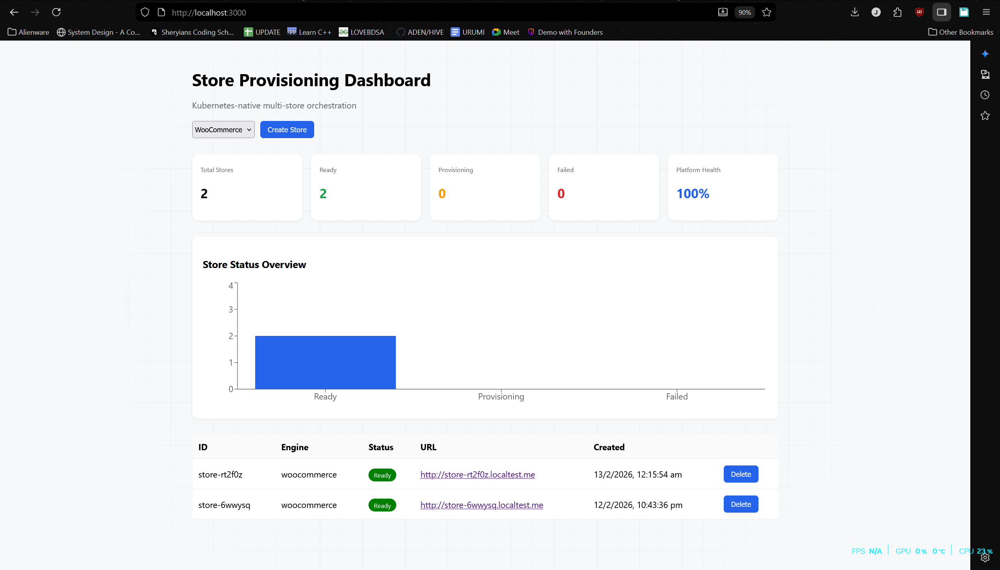
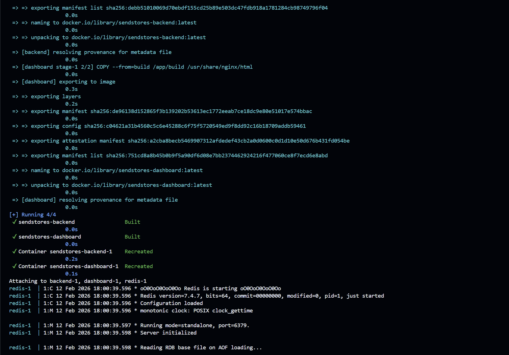

"# SendStores" 
Dashboard for monitoring the status of SendStores, a service that provides a way to store and retrieve data in a distributed manner. The dashboard displays various metrics related to the performance and health of the SendStores service, such as request latency, error rates, and resource utilization. It allows users to quickly identify any issues or bottlenecks in the system and take appropriate actions to resolve them. The dashboard is designed to be user-friendly and provides real-time updates on the status of the SendStores service.

A screenshot of the docker build process, showing the various steps involved in building the SendStores dashboard application. The build process includes installing dependencies, compiling the application codebase, and creating a Docker image that can be deployed to a containerized environment. The screenshot highlights the successful completion of each step, indicating that the build process was completed without any errors. This is an important step in the development and deployment of the SendStores dashboard, as it ensures that the application is properly packaged and ready for deployment to production environments.
