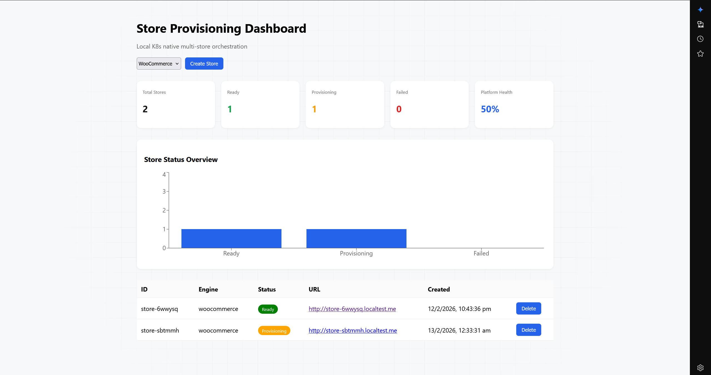
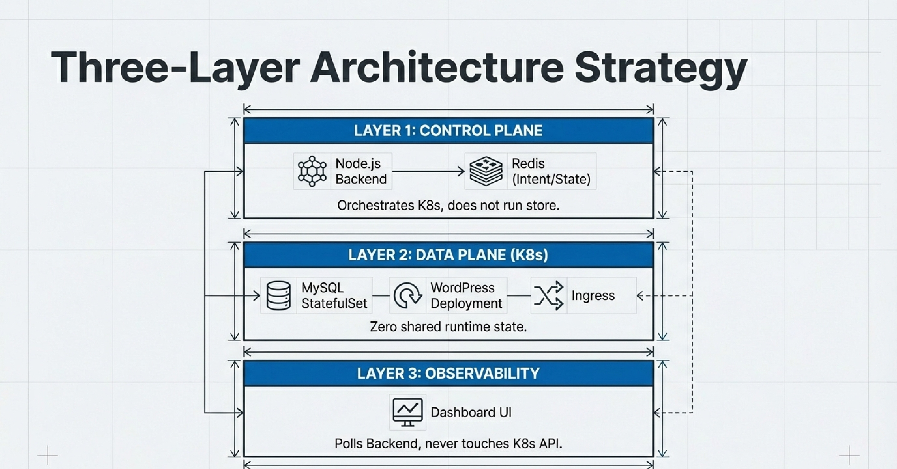

# SendStores
### Kubernetes-Native Multi-Store Control Plane
A simplified control plane for provisioning isolated, on-demand e-commerce stores using Kubernetes and Helm.

# ☁️ SendStores — Live Dashboard

<p align="center">
  <a href="http://13-234-35-173.sslip.io:3000/" target="_blank">
    
  </a>
    <a href="[http://13-234-35-173.sslip.io:3000/](http://13-204-92-56.sslip.io:3000/)" target="_blank">
    
  </a>
</p>

<h1 align="center">
  <strong>Live URL:</strong><br/><br/>
  <a href="http://13-234-35-173.sslip.io:3000/" target="_blank">
    http://13-234-35-173.sslip.io:3000/
  </a>
</h1>

<h1 align="center">
  <strong>Live URL:</strong><br/><br/>
  <a href="http://13-204-92-56.sslip.io:3000/" target="_blank">
    http://13-204-92-56.sslip.io:3000/
  </a>
</h1>




<center><p><b>DO CHECKOUT THE MARIADB BRANCH FOR OPTMIZED DATABASE PERFROMANCE PER STORE</b></p></center>

# Overview
This project implements a Kubernetes-native architecture to provision, manage, and tear down isolated WordPress + WooCommerce instances. Unlike standard multi-site installations, this system leverages namespace-level isolation, ensuring each store runs as a distinct set of workloads with its own database, persistent storage, and networking rules.
The core goal is to demonstrate a production-aligned "SaaS" pattern where a Node.js backend orchestrates Helm charts to create ephemeral or permanent store environments without manual intervention.

<!-- -------------------------------------------------------------------------------- -->
# Features

- Namespace Isolation: Each store is deployed into its own Kubernetes namespace, ensuring hard isolation for secrets, volumes, and networking.
- Helm as the Contract: Uses a single Helm chart for all deployments. Environment differences (Local vs. Prod) are handled strictly via values.yaml files—no duplicated manifests.
- Automated Lifecycle: A Node.js backend handles the creation (Helm install), state tracking (Redis), and destruction (Helm uninstall) of stores.
- Persistence: Each store is provisioned with dynamic Persistent Volume Claims (PVCs) for both the MySQL database and WordPress content.
- Ingress-Ready: Automatically configures Ingress rules to expose stores on unique subdomains (e.g., store-id.localtest.me).
- Deterministic Bootstrapping: Solves the "empty WordPress" problem by executing wp-cli commands directly within the runtime context.

<!-- -------------------------------------------------------------------------------- -->
# User Stories

1. The "One-Click" Provisioning Story
    - As a platform operator, I want to click "Create Store" via an API or Dashboard, so that a fully functional WooCommerce store is generated with a unique URL, requiring no manual installation steps.
2. The Isolation Story
    - As a tenant, I need my store's database and files to be completely separate from other stores, so that a security breach or configuration error in one store does not affect mine.
3. The Clean Teardown Story
    - As a developer, I want to be able to delete a store and have all associated resources (PVCs, Secrets, Services) removed immediately to prevent resource leaks in the cluster.

<!-- -------------------------------------------------------------------------------- -->
#  Architecture



The system allows a Control Plane (running outside the cluster or in a management namespace) to orchestrate a Data Plane (the stores).
1. _**Control Plane (Node.js + Redis)**_
    - Backend: Accepts POST /stores requests. It generates a unique Store ID and maps it to a Kubernetes Namespace.
    - State Store (Redis): Acts as the single source of truth for "Control Plane Intent" (e.g., is the store provisioning, ready, or failed?).
    - Orchestration: Wraps the Helm CLI to execute helm install and helm uninstall commands programmatically.
2. _**Data Plane (Kubernetes)**_
    - For every store created, the system spins up the following inside a dedicated namespace:
        - MySQL: StatefulSet with dedicated PVC.
        - WordPress: Deployment running a custom image.
        - Networking: ClusterIP Service and Ingress Controller routing.
        - Secrets: Auto-generated database credentials.
3. _**UI Plane**_
    - Has the dashboard and graph interfaces

<!-- -------------------------------------------------------------------------------- -->
#  Engineering Challenges & Solutions
The "Bootstrapping" Problem
The Issue: Initially, provisioning a store resulted in a WordPress instance displaying the "Language Selection" and "Install" screen. Helm Hooks using wp-cli Jobs failed due to race conditions and filesystem mismatches between the Job container and the main WordPress container.
The Solution: We moved the bootstrapping logic inside the runtime.
1. Custom Image: Built a WordPress image that includes the wp-cli binary.
2. Post-Install Exec: The backend triggers kubectl exec commands after the Pod is running. This ensures wp-cli operates on the exact same filesystem and PHP environment as the live site, guaranteeing a fully installed WooCommerce storefront upon first visit.

<!-- -------------------------------------------------------------------------------- -->
# Installation & Setup

Prerequisites
• Kubernetes Cluster (Minikube, Kind, or Docker Desktop)
• Helm 3+ installed locally.
• Node.js (v18+) & Redis running locally or accessible via URL.
• Ingress Controller (e.g., NGINX) enabled on your cluster.
### Clone & Dependencies
```bash
git clone https://github.com/JVSCHANDRADITHYA/SendStores
cd SendStores
```

### Run docker compose 
```bash
docker-compose up --build
```
### THE FRONTEND AND BACKEND
```bash
FRONTEND DASHBOARD AT http://localhost:3000/
BACKEND SERVER AT http://localhost:4000 [use /stores]
```
## OR YOU CAN BUILD INDEPENDENTLY

Refer to [INDIVIDUAL-BUILD.md](INDIVIDUAL-BUILD.md)

# SCREENSHOTS of the WORKING APPLICATION


<!-- -------------------------------------------------------------------------------- -->
# Future Roadmap
• Production Hardening: Move the manual kubectl exec bootstrapping into a Kubernetes Operator or a refined Init Container pattern.
• GenAI Management Agent: implementing a Generative AI agent capable of summarizing store status, detailing configuration, and performing management actions via natural language prompts.
• Chart Publication: Releasing the finalized, bootstrap-ready Helm chart to a public repository.

<!-- -------------------------------------------------------------------------------- -->
